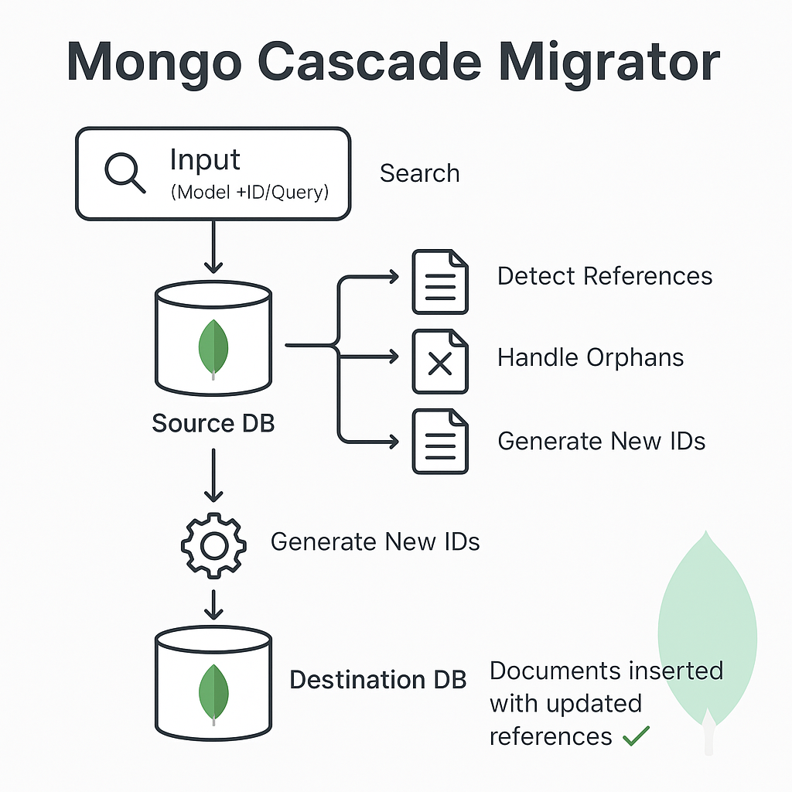

# mongo-cascade-migrator

A MongoDB document migration tool that handles recursive document references and maintains data integrity during migration.

<div align="center">
  
</div>

## Features

- Migrates documents and their references recursively
- Handles nested objects and arrays
- Maintains referential integrity
- Supports single document and bulk migrations
- Handles duplicate key conflicts intelligently
- Preserves timestamps and metadata
- Supports complex reference chains
- Command-line interface for easy usage

## Installation

Run the following command to install the dependencies:

```bash
npm install
```

## Configuration

Create a `.env` file in your project root with the following variables:

```env
SOURCE_MONGODB_URI=mongodb://source-uri
TARGET_MONGODB_URI=mongodb://target-uri
```

## Schema Configuration

### Adding Your Schemas

The `models/schemas` directory is reserved exclusively for Mongoose schema definitions. No other code or logic should be placed in this directory. The `Authors` and `Books` schemas are provided as examples and can be modified or replaced with your own schemas.

Example schema structure:

```javascript
// models/schemas/YourModel.js
const { Schema } = require('mongoose');

const YourModelSchema = new Schema(
  {
    // Your fields here
    field1: String,
    field2: { type: Schema.Types.ObjectId, ref: 'RelatedModel' },
  },
  { timestamps: true }
);

// Add indexes for better performance
YourModelSchema.index({ field1: 1 });
YourModelSchema.index({ field2: 1 });

module.exports = YourModelSchema;
```

### Important Notes

1. **Schema Location**: All your schemas must be placed in the `models/schemas` directory
2. **Reference Definitions**: Always use the `ref` option for references to other models
3. **Indexes**: Add appropriate indexes for fields you'll query frequently
4. **Timestamps**: Consider using `{ timestamps: true }` to track document creation and updates
5. **Example Schemas**: Feel free to modify or replace the example `Authors` and `Books` schemas

## Usage

### Command Line Interface (CLI)

The simplest way to use the migrator is through the CLI:

```bash
# Migrate a single document
node index.js --model=Books --id=bookId

# Migrate documents matching a query
node index.js --model=Books --query='{"title": "The Hobbit"}'
```

## Features in Detail

### Reference Handling

- Single references (ObjectId)
- Array of references
- Nested object references
- Complex reference chains

### Error Handling

- Duplicate key detection
- Orphaned reference handling
- Conflict resolution for existing documents

### Data Integrity

- Maintains referential integrity
- Preserves document relationships
- Handles circular references
- Preserves timestamps

## Testing

The project includes comprehensive E2E tests that demonstrate:

- Single document migration
- Document with nested references
- Bulk document migration
- Reference integrity verification

Run tests with:

```bash
npm test
```

## Contributing

Contributions are welcome! Please feel free to submit a Pull Request.

## License

This project is licensed under the MIT License - see the [LICENSE](LICENSE) file for details.
